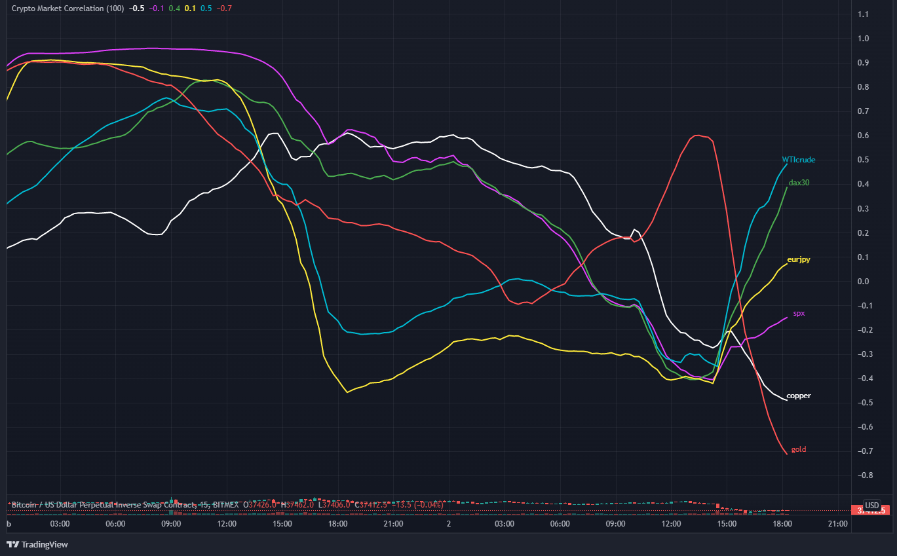
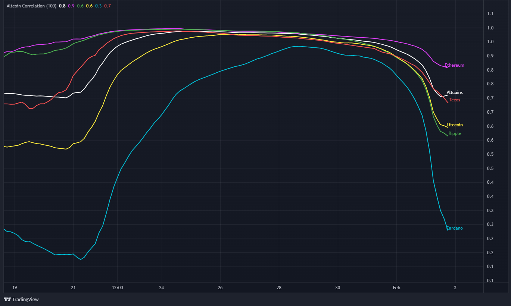

# CorrelationIndicator
Crypto Asset Correlation in Real Time

Platform: TradingView

Programming Language: PineScript

Instrument : BTC/USD

The indicator compares the degree of correleation of different asset classes and crytpocurrencies against Bitcoin

**Correlation Index**

This code compares BTC against the below:

    1. Copper ( proxy for growth)
    2. S&P 500 ( Equity Markets)
    3. DAX 30 ( European Indices)
    4. EUR/JPY ( Market Risk Sentiment)
    5. WTICrude ( Commodity Markets)
    6. Gold ( Risk Sentiments)
    
 Screenshot of Correlation Indicator
   

**Altcoin Correlation**

This code compares BTC against the below:

    1. Altcoin Index
    2. Ethereum
    3. Ripple
    4. Litecoin
    5. Cardano
    6. Tezos
    
 Screenshot of Altcoin Correlation Indicator

